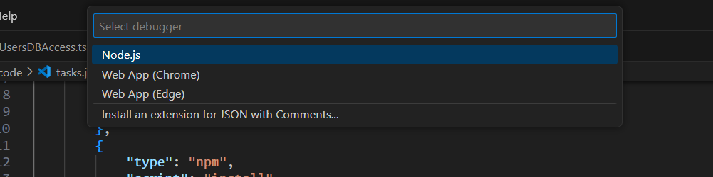
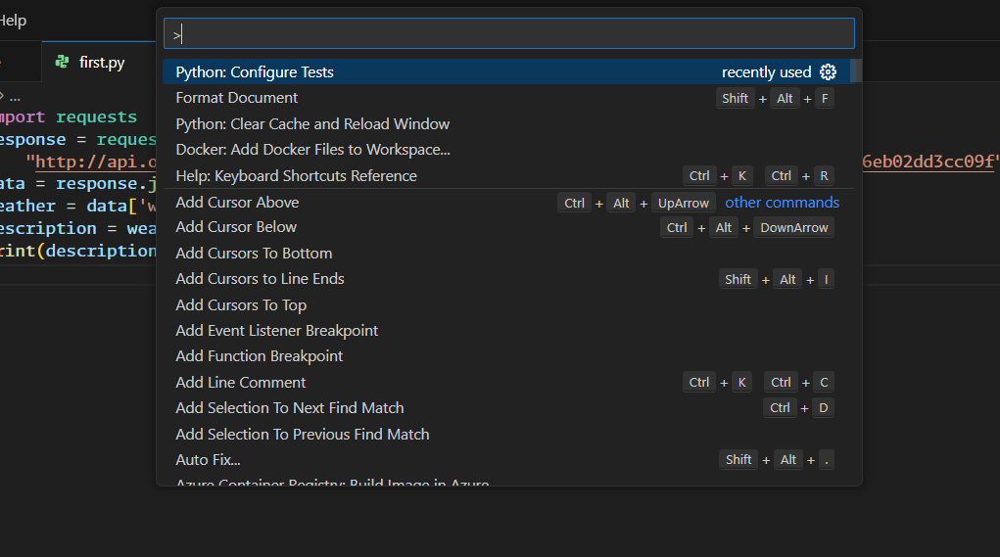
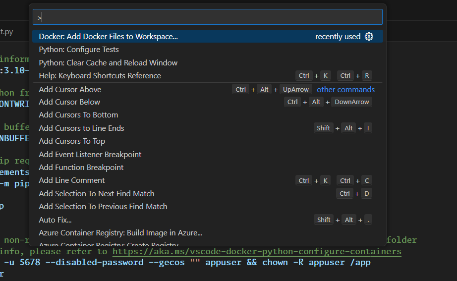

# [MY VS CODE SETUP](https://github.com/users/ccweerasinghe1994/projects/8/views/1)

## 02 - First steps with VSCode
### 002 Visual Studio Code interface

to go to a line: `ctrl + g`


### 003 Command palette and keyboard shortcuts 

to open the command palette: `ctrl + shift + p`

General


### Working With Files

to search for a file: `ctrl + p`


to find a usage of a method/variable: `alt + shift + f12`


to see the call hierarchy: `alt + shift + h`


then we can see what methods are called by the method we selected


you can `Ctrl + click` on a method to go to its definition.

multiple cursors: `alt + click`


### 005 VSCode settings

let's install vs code icons


to open vs code settings: `ctrl + ,`

when we are changing the settings, we can see the changes in the json file.
there are user settings and workspace settings.


sample settings.json file

```json
{   
    // Editor font related Settings
    "editor.fontSize": 16,
    "editor.fontFamily": "'Monaspace Argon','Monaspace Neon',Consolas, 'Courier New', monospace",
    "editor.fontWeight": "400",
    "editor.fontLigatures": "'ss01', 'ss02', 'ss03', 'ss04', 'ss05', 'ss06', 'ss07', 'ss08', 'calt', 'dlig'",
    // this is the terminal settings
    "terminal.integrated.fontFamily": "'Monaspace Krypton','Monaspace Radon','Monaspace Xenon','Monaspace Argon'",
    "files.autoSave": "onFocusChange"
}
```

### 006 Workspaces

we can use workspaces to link multiple code repos together.


will have version control for each workspace
### 007 VSCode Extensions
let's open vs code extensions: `ctrl + shift + x`


let's install gitLens


we can see the logs of a extension 


## 03 - Coding with Code

### Intellisense

IntelliSense is a general term for various code editing features including: code completion, parameter info, quick info, and member lists. IntelliSense features are sometimes called by other names such as "code completion", "content assist", and "code hinting."

vs code https://code.visualstudio.com/docs/editor/intellisense

to see the intellisense: `ctrl + space`
or type `.` after a variable(triggers intellisense)

we can use IntelliCode extension to get better intellisense


https://marketplace.visualstudio.com/items?itemName=VisualStudioExptTeam.vscodeintellicode


### Linting and formatting

let's install following extensions


we can create a config file

```json
{
    "env": {
        "browser": true,
        "es2021": true
    },
    "extends": "standard-with-typescript",
    "overrides": [],
    "parserOptions": {
        "ecmaVersion": "latest",
        "sourceType": "module"
    },
    "rules": {
        "no-trailing-spaces": "warn",
        "@typescript-eslint/no-misused-promises": "warn",
        "indent": "off",
        "@typescript-eslint/indent": "warn",
        "@typescript-eslint/explicit-function-return-type": "warn",
        "space-before-function-paren": "off",
        "@typescript-eslint/space-before-function-paren": "warn"
    }
}
```
which will show up in the browser


### Refactoring with VSCode

to rename a variable: `f2`
this will changes all the occurrences of the variable in whole project


this will update all the files 


to refactor a method: `ctrl + shift + r`

### Terminal and Tasks

Tasks


```json
{
    // See https://go.microsoft.com/fwlink/?LinkId=733558
    // for the documentation about the tasks.json format
    "version": "2.0.0",
    "tasks": [
        {
            "label": "echo",
            "type": "shell",
            "command": "echo Hello"
        },
        {
            "type": "npm",
            "script": "install",
            "group": "clean",
            "problemMatcher": [],
            "label": "npm: install",
            "detail": "install dependencies from package"
        }
    ]
}
```

### The Debugger




vs code debugger https://github.com/microsoft/vscode-recipes

### Debugging front end code
```json

```
## 04 - Web design

### 002 Writing HTML
we can use emmet to write html faster
### 003 Writing CSS
we can use emmet to write css faster
### 004 Live Server Extension


```shell
ipconfig
ifconfig
```

## 05 - Remote development

### 002 Remote SSH


go to your remote machine and run following command

```shell
sudo apt-get install openssh-server
```

on your remote machine run following command
```shell
ifconfig
```

if the above command doesn't work, run following command
```shell
sudo apt-get install net-tools
```

```shell
ens33: flags=4163<UP,BROADCAST,RUNNING,MULTICAST>  mtu 1500
        inet 172.26.109.190  netmask 255.255.240.0  broadcast 172.26.111.255
        inet6 fe80::27f0:ed74:e48a:a024  prefixlen 64  scopeid 0x20<link>
        ether 00:0c:29:63:45:db  txqueuelen 1000  (Ethernet)
        RX packets 243730  bytes 356091262 (356.0 MB)
        RX errors 0  dropped 0  overruns 0  frame 0
        TX packets 34946  bytes 4395614 (4.3 MB)
        TX errors 0  dropped 0 overruns 0  carrier 0  collisions 0
```

then go to your local machine and run following command
you can ssh in to the remote machine using the above command
```shell
ssh chamara@172.26.109.190
```

```shell
sudo service ssh status
```

```shell
sh.service - OpenBSD Secure Shell server
     Loaded: loaded (/lib/systemd/system/ssh.service; enabled; vendor preset: enabled)
     Active: active (running) since Mon 2023-11-20 17:23:30 +0530; 15min ago
       Docs: man:sshd(8)
             man:sshd_config(5)
   Main PID: 25071 (sshd)
      Tasks: 1 (limit: 9387)
     Memory: 1.8M
        CPU: 270ms
     CGroup: /system.slice/ssh.service
             └─25071 "sshd: /usr/sbin/sshd -D [listener] 0 of 10-100 startups"
```

to use ssh in vs code, we need to install remote ssh extension

then type `ctrl + shift + p` and type `remote ssh` and select `connect to host`


now you can open files inside the remote machine


### 003 Docker for VSCode
install docker extension


The Docker extension makes it easy to build, manage, and deploy containerized applications from Visual Studio Code. It also provides one-click debugging of Node.js, Python, and .NET inside a container.

this extension will provide 
- syntax highlighting
- snippets
- linting
- debugging
- IntelliSense
- Dockerfile support
- Docker Compose support
- Docker commands (start, stop, restart, etc)
- Docker Explorer
- Docker view for inspecting containers and images
- Kubernetes support
- Azure Container Registry support
- Azure Container Instances support
- Azure IoT Edge support
- Remote Docker support
- WSL 2 support
- Volume management
- Docker Compose v3 support
- Docker Compose debugging
- Docker Compose Tasks
- Docker Compose Explorer
- Docker Compose view for inspecting containers, networks, and volumes

and much more!

to add docker to your project


this will ask questions about your project and create a docker file for you
```dockerfile
FROM node:lts-alpine
# ENV NODE_ENV=production
ENV NODE_ENV=development
WORKDIR /usr/src/app
COPY ["package.json", "package-lock.json*", "npm-shrinkwrap.json*", "./"]
# RUN npm install --production --silent && mv node_modules ../
RUN npm install
COPY . .
EXPOSE 8080
RUN chown -R node /usr/src/app
USER node
CMD ["npm", "start"]

```
```dockerignore
**/.classpath
**/.dockerignore
**/.env
**/.git
**/.gitignore
**/.project
**/.settings
**/.toolstarget
**/.vs
**/.vscode
**/*.*proj.user
**/*.dbmdl
**/*.jfm
**/charts
**/docker-compose*
**/compose*
**/Dockerfile*
**/node_modules
**/npm-debug.log
**/obj
**/secrets.dev.yaml
**/values.dev.yaml
LICENSE
README.md

```docker-compose.yml```
```yml
version: '3.4'

services:
  managerserver:
    image: managerserver
    build:
      context: .
      dockerfile: ./Dockerfile
    environment:
      NODE_ENV: development
    ports:
      - 8080:8080

```

`docker-compose.debug.yml`
```yml
version: '3.4'

services:
  managerserver:
    image: managerserver
    build:
      context: .
      dockerfile: ./Dockerfile
    environment:
      NODE_ENV: development
    ports:
      - 3000:3000
      - 9229:9229
    command: ["node", "--inspect=0.0.0.0:9229", "index.js"]


```

to start the docker container, type `ctrl + shift + p` and type `docker compose up`


now open the docker extension and you can see the running containers


you have following options


logs


shell


or open it using vscode

### 004 Developing inside a container

we can use dev container with our docker file to develop inside a container.

anyone who has docker installed can use this feature.


`devcontainer.json`

```json
// For format details, see https://aka.ms/devcontainer.json. For config options, see the
// README at: https://github.com/devcontainers/templates/tree/main/src/docker-existing-dockerfile
{
	"name": "Manager Server Dev Container",
	"build": {
		// Sets the run context to one level up instead of the .devcontainer folder.
		"context": "..",
		// Update the 'dockerFile' property if you aren't using the standard 'Dockerfile' filename.
		"dockerfile": "../Dockerfile"
	}
	// Features to add to the dev container. More info: https://containers.dev/features.
	// "features": {},
	// Use 'forwardPorts' to make a list of ports inside the container available locally.
	,
	"forwardPorts": [
		8080
	]
	// Uncomment the next line to run commands after the container is created.
	// "postCreateCommand": "cat /etc/os-release",
	// Configure tool-specific properties.
	,
	"customizations": {
		"vscode": {
			"extensions": [
				"humao.rest-client",
				"VisualStudioExptTeam.intellicode-api-usage-examples",
				"eamodio.gitlens",
				"dbaeumer.vscode-eslint"
			]
		}
	},
	"features": {
		"ghcr.io/devcontainers/features/git:1": {}
	}
	// Uncomment to connect as an existing user other than the container default. More info: https://aka.ms/dev-containers-non-root.
	// "remoteUser": "devcontainer"
}
```

## 06 - Favorite extensions

### 002 Visual adjustments extensions
icons


 

### 003 Productivity extensions


### 004 Frameworks (React, Vue, Angular)

Angular


vue


## 07 - Git

### Git basic commands
```shell
git status

git init

git add .

git commit -m "initial commit"

git push

```

create a github account to push code

### Git in VS Code


### Git commit

we add node modules to git ignore file


### Git branches

to create a branch: `ctrl + shift + p` and type `git branch` and select `git: create branch`
```shell
git checkout -b "feature/branch"
```


### Handling commit conflicts

### Git Lens extension
install git lens extension
### Markdown language
vscode has a markdown previewer
### Live Share extension
install live share extension

## 08 - Python in VSCode
### 003 Python in VSCode


### 004 Python debugger


```json
{
    // Use IntelliSense to learn about possible attributes.
    // Hover to view descriptions of existing attributes.
    // For more information, visit: https://go.microsoft.com/fwlink/?linkid=830387
    "version": "0.2.0",
    "configurations": [
        {
            "name": "Python: Current File",
            "type": "python",
            "request": "launch",
            "program": "${file}",
            "console": "integratedTerminal",
            "justMyCode": true
        },
        {
            "name": "Python: Current File",
            "type": "python",
            "request": "launch",
            "program": "${file}",
            "console": "integratedTerminal"
        }
    ]
} 
```
### 006 Python unit testing



this will create this settings.json
```json
{
    "python.testing.unittestArgs": [
        "-v",
        "-s",
        "./test",
        "-p",
        "*test*.py"
    ],
    "python.testing.pytestEnabled": false,
    "python.testing.unittestEnabled": true
}
```

### 007 Python with Docker



```dockerfile
# For more information, please refer to https://aka.ms/vscode-docker-python
FROM python:3.10-slim

# Keeps Python from generating .pyc files in the container
ENV PYTHONDONTWRITEBYTECODE=1

# Turns off buffering for easier container logging
ENV PYTHONUNBUFFERED=1

# Install pip requirements
COPY requirements.txt .
RUN python -m pip install -r requirements.txt

WORKDIR /app
COPY . /app

# Creates a non-root user with an explicit UID and adds permission to access the /app folder
# For more info, please refer to https://aka.ms/vscode-docker-python-configure-containers
RUN adduser -u 5678 --disabled-password --gecos "" appuser && chown -R appuser /app
USER appuser

# During debugging, this entry point will be overridden. For more information, please refer to https://aka.ms/vscode-docker-python-debug
CMD ["python", "first.py"]

```

```dockerignore
**/__pycache__
**/.venv
**/.classpath
**/.dockerignore
**/.env
**/.git
**/.gitignore
**/.project
**/.settings
**/.toolstarget
**/.vs
**/.vscode
**/*.*proj.user
**/*.dbmdl
**/*.jfm
**/bin
**/charts
**/docker-compose*
**/compose*
**/Dockerfile*
**/node_modules
**/npm-debug.log
**/obj
**/secrets.dev.yaml
**/values.dev.yaml
LICENSE
README.md

```

```docker-compose.yml
version: '3.4'

services:
  pythonpractice:
    image: pythonpractice
    build:
      context: .
      dockerfile: ./Dockerfile
```
```docker-compose.debug.yml
version: '3.4'

services:
  pythonpractice:
    image: pythonpractice
    build:
      context: .
      dockerfile: ./Dockerfile
    command: ["sh", "-c", "pip install debugpy -t /tmp && python /tmp/debugpy --wait-for-client --listen 0.0.0.0:5678 first.py "]
    ports:
      - 5678:5678

```
```requirements.txt
# To ensure app dependencies are ported from your virtual environment/host machine into your container, run 'pip freeze > requirements.txt' in the terminal to overwrite this file
requests
```

for debug 


## 09 - Java in VSCode
## 10 - C++ in VSCode (and C#)
## 11 - Creating a VSCode extension
## 12 - Visual Studio Code insights

