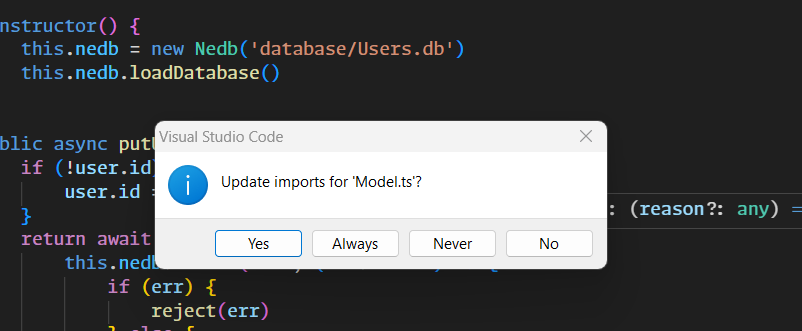

# [MY VS CODE SETUP](https://github.com/users/ccweerasinghe1994/projects/8/views/1)

## 02 - First steps with VSCode
### 002 Visual Studio Code interface

to go to a line: `ctrl + g`


### 003 Command palette and keyboard shortcuts 

to open the command palette: `ctrl + shift + p`

General


### Working With Files

to search for a file: `ctrl + p`


to find a usage of a method/variable: `alt + shift + f12`


to see the call hierarchy: `alt + shift + h`


then we can see what methods are called by the method we selected


you can `Ctrl + click` on a method to go to its definition.

multiple cursors: `alt + click`


### 005 VSCode settings

let's install vs code icons


to open vs code settings: `ctrl + ,`

when we are changing the settings, we can see the changes in the json file.
there are user settings and workspace settings.


sample settings.json file

```json
{   
    // Editor font related Settings
    "editor.fontSize": 16,
    "editor.fontFamily": "'Monaspace Argon','Monaspace Neon',Consolas, 'Courier New', monospace",
    "editor.fontWeight": "400",
    "editor.fontLigatures": "'ss01', 'ss02', 'ss03', 'ss04', 'ss05', 'ss06', 'ss07', 'ss08', 'calt', 'dlig'",
    // this is the terminal settings
    "terminal.integrated.fontFamily": "'Monaspace Krypton','Monaspace Radon','Monaspace Xenon','Monaspace Argon'",
    "files.autoSave": "onFocusChange"
}
```

### 006 Workspaces

we can use workspaces to link multiple code repos together.


will have version control for each workspace
### 007 VSCode Extensions
let's open vs code extensions: `ctrl + shift + x`


let's install gitLens


we can see the logs of a extension 


## 03 - Coding with Code

### Intellisense

IntelliSense is a general term for various code editing features including: code completion, parameter info, quick info, and member lists. IntelliSense features are sometimes called by other names such as "code completion", "content assist", and "code hinting."

vs code https://code.visualstudio.com/docs/editor/intellisense

to see the intellisense: `ctrl + space`
or type `.` after a variable(triggers intellisense)

we can use IntelliCode extension to get better intellisense


https://marketplace.visualstudio.com/items?itemName=VisualStudioExptTeam.vscodeintellicode


### Linting and formatting

let's install following extensions


we can create a config file

```json
{
    "env": {
        "browser": true,
        "es2021": true
    },
    "extends": "standard-with-typescript",
    "overrides": [],
    "parserOptions": {
        "ecmaVersion": "latest",
        "sourceType": "module"
    },
    "rules": {
        "no-trailing-spaces": "warn",
        "@typescript-eslint/no-misused-promises": "warn",
        "indent": "off",
        "@typescript-eslint/indent": "warn",
        "@typescript-eslint/explicit-function-return-type": "warn",
        "space-before-function-paren": "off",
        "@typescript-eslint/space-before-function-paren": "warn"
    }
}
```
which will show up in the browser


### Refactoring with VSCode

to rename a variable: `f2`
this will changes all the occurrences of the variable in whole project



this will update all the files 


to refactor a method: `ctrl + shift + r`

### Terminal and Tasks

Tasks


```json
{
    // See https://go.microsoft.com/fwlink/?LinkId=733558
    // for the documentation about the tasks.json format
    "version": "2.0.0",
    "tasks": [
        {
            "label": "echo",
            "type": "shell",
            "command": "echo Hello"
        },
        {
            "type": "npm",
            "script": "install",
            "group": "clean",
            "problemMatcher": [],
            "label": "npm: install",
            "detail": "install dependencies from package"
        }
    ]
}
```

### The Debugger


vs code debugger https://github.com/microsoft/vscode-recipes

### Debugging front end code
```json

```
## 04 - Web design
## 05 - Remote development
## 06 - Favorite extensions
## 07 - Git
## 08 - Python in VSCode

## 09 - Java in VSCode
## 10 - C++ in VSCode (and C#)
## 11 - Creating a VSCode extension
## 12 - Visual Studio Code insights